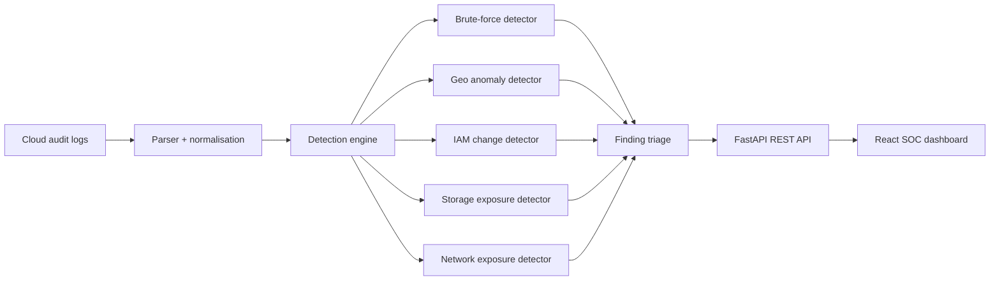

# CloudGuard architecture

## Detection philosophy

CloudGuard deliberately uses transparent deterministic detectors for the first version. Each finding is explainable from its source events, severity can be traced to a documented rule, and unit tests can assert exactly when a detection should or should not fire.

This is useful for a security project because opaque anomaly scores are not enough for incident response. Analysts need evidence, context and an auditable reason for escalation.

## Current detections

| Detection | Signal | Severity |
| --- | --- | --- |
| Repeated failed console logins | 5+ failures for the same actor/IP in 10 minutes | High |
| Rapid geographic access change | Successful access from two countries within 2 hours | High |
| Sensitive IAM change | Policy attachment, inline policy, access-key creation or group change | High/Critical |
| Public storage exposure | Bucket ACL changed to public | Critical |
| Internet-exposed remote admin | SSH/RDP opened to `0.0.0.0/0` | Critical |

## Production evolution

1. Stream events from AWS EventBridge / CloudTrail rather than file uploads.
2. Persist events, findings and analyst notes in PostgreSQL.
3. Add organisation tenancy, authentication and role-based access control.
4. Add enrichment from IP reputation, ASN and asset inventory sources.
5. Add finding state, assignment, comments and audit trails.
6. Deploy on AWS ECS/Fargate with RDS and Terraform.
7. Add OpenTelemetry metrics, structured logs and alert delivery.
